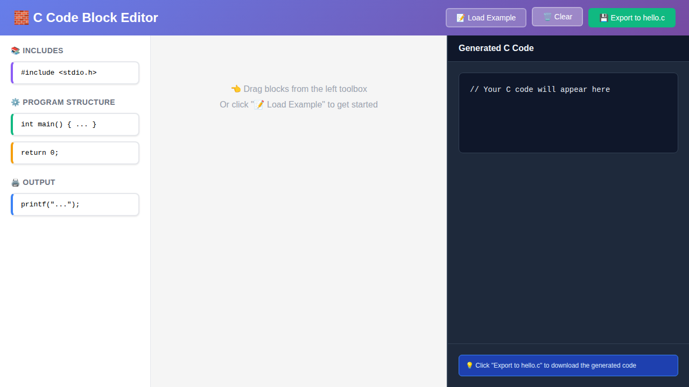
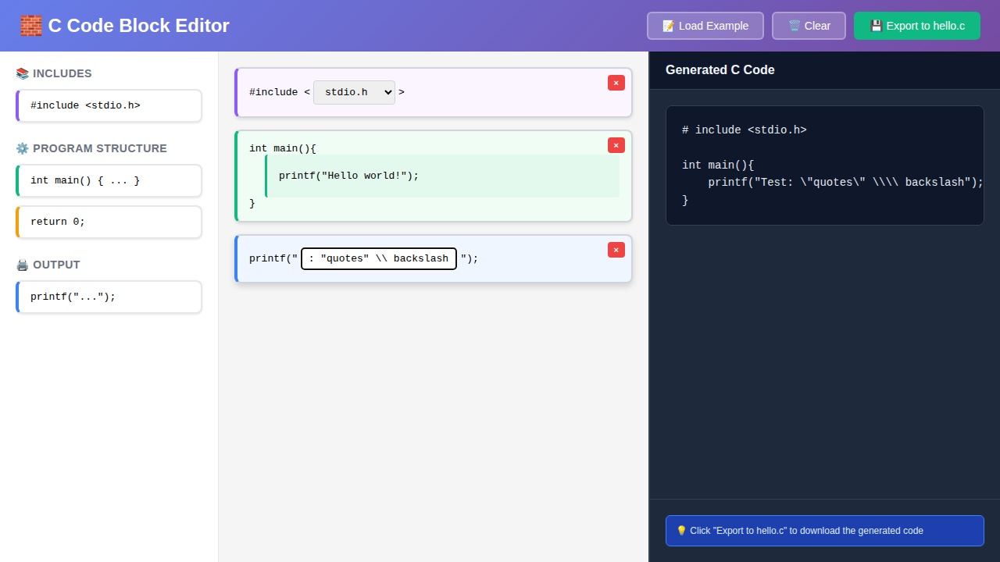

# Hello World

Test repo for JediMaster

## Visual Block Editor

This project includes a web-based visual block editor for creating C code! 🧱

### Quick Start

Open `editor.html` in your browser to create C programs using drag-and-drop blocks.

```bash
# Option 1: Open directly
open editor.html

# Option 2: Use a local web server
python3 -m http.server 8000
# Then navigate to: http://localhost:8000/editor.html
```

### Features

- 🎨 **Drag-and-drop interface** - Build C programs visually
- 🔄 **Real-time code generation** - See your C code update as you build
- 💾 **Export to hello.c** - Download your generated code
- 📝 **Pre-loaded example** - Get started with a "Hello World" template
- ⚙️ **Multiple block types** - Includes, main function, printf, return statements

### Usage

1. Drag blocks from the left toolbox to the workspace
2. Configure block parameters (library names, text strings, etc.)
3. Watch the generated C code update in real-time
4. Click "Export to hello.c" to download your code
5. Compile and run: `gcc -o hello hello.c && ./hello`

For detailed instructions, see [EDITOR_GUIDE.md](EDITOR_GUIDE.md)

### Screenshots

**Visual Editor with Example:**


**Empty Workspace:**



**Input Sanitization:**

